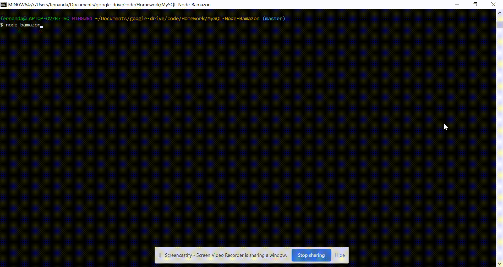

# Bamazon

Bamazon is an Amazon-like storefront using MySQL and Node.js. It consists of two apps: a customer order view and a manager action view.

## Demo

**Customer Interface:**



**Manager Interface:**


## How It Works

Bamazon is a CLI App that uses MySQL calls to manage the localhost database, update records, join tables, and calculate additional data in real-time. User input is handled by the Inquirer npm package and database calls are handled by the MySQL package.

### Bamazon Customer

* Displays a table with product ID, name, and price 
  
* Prompts customer to place an order
  
* If item is in stock, total price is displayed

* If item is not in stock, order does not go through

To run the customer interface, please follow the steps below:

```js
git clone git@github.com:fernandamarr/MySQL-Node-Bamazon.git
cd MySQL-Node-Bamazon
npm install
node bamazonCustomer.js
```

### Bamazon Manager

* View products for sale

* View low inventory

* Add to inventory

* Add new product

To run the manager interface, please follow the steps below:

```js
git clone git@github.com:fernandamarr/MySQL-Node-Bamazon.git
cd MySQL-Node-Bamazon
npm install
node bamazonManager.js
```

### MySQL Database Setup

To run this application, install MySQL and MySQL Workbench. Visit the [MySQL installation page](https://dev.mysql.com/downloads/installer/) to install it on your machine. Then visit the [MySQL Workbench Installation page](https://dev.mysql.com/downloads/workbench/) and install the version that is compatible with your machine. Once you have both installed, create the Bamazon database and the products table with the SQL code found in [Bamazon.sql](https://github.com/fernandamarr/MySQL-Node-Bamazon/blob/master/bamazon.sql). Run this code inside your MySQL Workbench, then you can run the Bamazon customer and manager interface.

## Technologies Used

* MySQL
* Node.js
* JavaScript