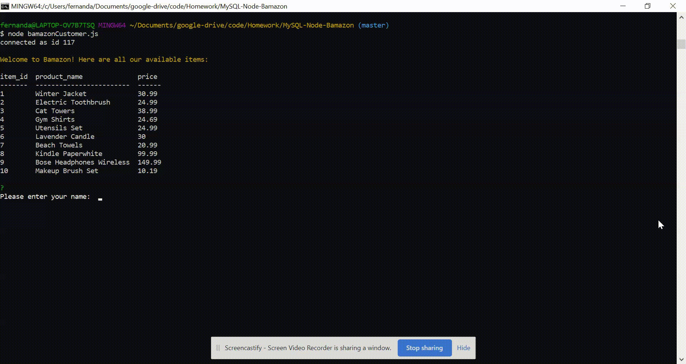

# Bamazon

Bamazon is an Amazon-like storefront app that takes in orders from customers and depletes stock from the store's inventory.



## How It Works

Bamazon is a CLI App that uses MySQL calls to manage the localhost database, update records, join tables, and calculate additional data in real-time. User input is handled by the Inquirer npm package and database calls are handled by the MySQL package.

## Demo

Video: coming soon

## Getting Started

Follow these steps to get started with Bamazon

## Clone the Repository

1. Clone this repository to your local directory and navigate to it by running the following commands:

``` js
git clone git@github.com:fernandamarr/MySQL-Node-Bamazon.git

cd MySQL-Node-Bamazon
```

## MySQL Database Setup

To run this application, you should install MySQL and MySQL Workbench. If you haven't already, visit the [MySQL installation page](https://dev.mysql.com/downloads/installer/) to install it on your machine. Then visit the [MySQL Workbench Installation page](https://dev.mysql.com/downloads/workbench/) and install the version that is compatible with your machine. Once you have both installed, create the Bamazon database and the products table with the SQL code found in [Bamazon.sql](https://github.com/fernandamarr/MySQL-Node-Bamazon/blob/master/bamazon.sql). Run this code inside your MySQL Workbench, then you can run the Bamazon customer interface.

## Customer View

Users can view the current store items for sale. A table is displayed with the product ID, name, and price. The user then gets a prompt asking for name input and if they would like to proceed with the purchase. If user selects yes, the user is asked to pick a product from the current inventory and are asked to enter how many items they would like to purchase. If the current product is in stock, the user receives a message saying their order was completed and lists the total purchase price. If the quantity isn't available, the user is prompted that there are not enough items to fulfill the order. After both scenarios, the user is prompted if they would like to continue shopping.

To run the customer interface please follow the steps below:

```js
git clone git@github.com:fernandamarr/MySQL-Node-Bamazon.git
cd bamazon
npm install
node bamazonCustomer.js
```

